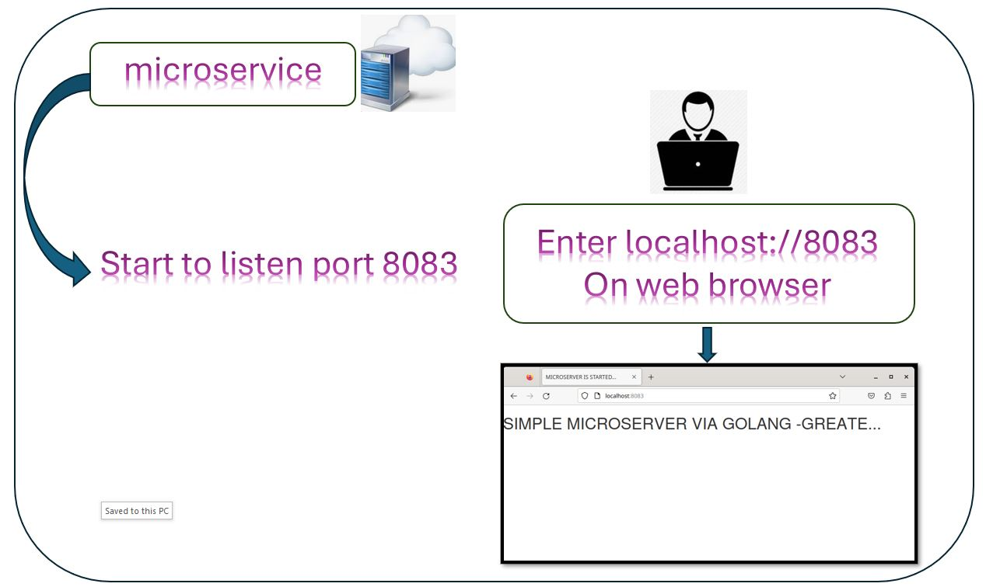
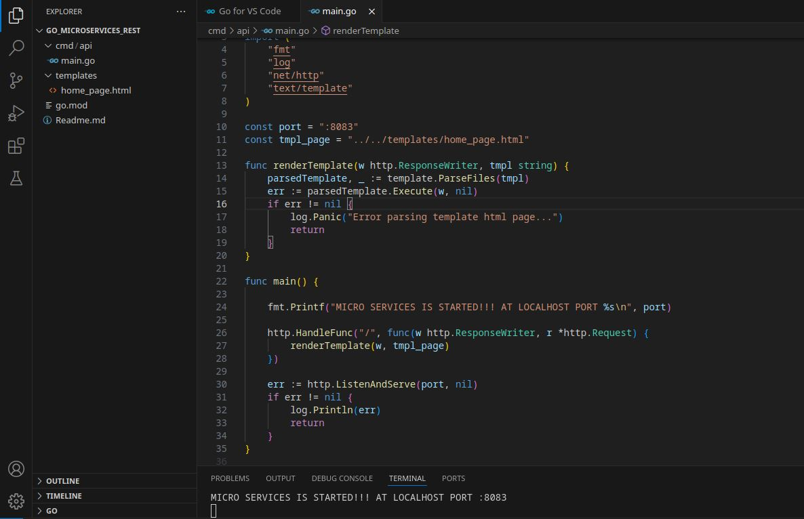

# BASIC MICROSERVICES VIA GOLANG

In this study, I will try to introduce the simplest web-based microservice using the Golang programming language. Intermediate level knowledge of Golang language will be sufficient.

> ## Working environment
>
> - Debian Operating System
> - Golang sw language

## General hierarchy of the project

## Whats is basic definition of microservices ?
Microservices are self-running applications that perform certain functions and special operations.
Java, Python, and Go are the languages that are easy to maintain and update, which is essential for building a microservice.The world's largest technology companies such as Amazon, Netflix, and Uber also use microservice structures.

## VS CODE hierarchy of the project

## Project directory tree

## Github source code

[github_source_code](https://github.com/MuratTunc/go_microservices_rest.git)