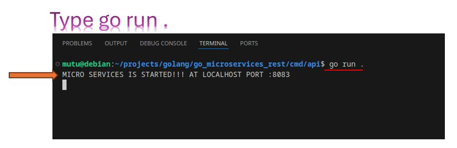
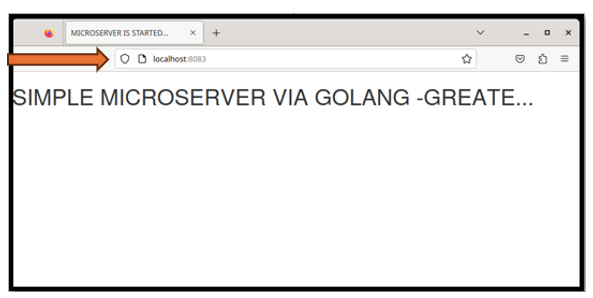

# BASIC RESTFUL MICROSERVICE VIA GOLANG

In this study, I will try to introduce the simplest web-based microservice using the Golang programming language. Intermediate level knowledge of Golang language will be sufficient.

> ## Working environment
>
> - Debian Operating System
> - Golang sw language

## General hierarchy of the project

## Whats is basic definition of microservices ?
Microservices are self-running applications that perform certain functions and special operations.
Java, Python, and Go are the languages that are easy to maintain and update, which is essential for building a microservice.The world's largest technology companies such as Amazon, Netflix, and Uber also use microservice structures.

## Restful API
The method is the type of request you send to the server. The four main resource methods that are associated with REST APIs are:

> - GET: This method allows for the server to find the data you requested and sends it back to you.
> - PUT: If you perform the ‘PUT’ request, then the server will update an entry in the database.
> - POST: This method permits the server to create a new entry in the database.
> - DELETE: This method allows the server to delete an entry in the database.

_We are using just **GET** request in this microservice_

## VS CODE hierarchy of the project

## Project directory tree

## Start microservice

## Start web browser

## Github source code

[github_source_code](https://github.com/MuratTunc/go_microservices_rest.git)

In this project, we have created a very simple microservice in the Golang language using the Restful API. Our service only responds to get requests. Of course, the remaining rest requests can also be added to the code.

__**I wish you good coding, thinking that it is educational and fun.**__